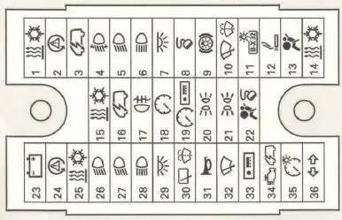
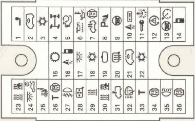

# VW Transporter 5, California
Baujahr 2011

Positionen der Sicherungen im Fahrzeug, siehe hier: https://youtube.com/shorts/fF-ZMMC81cQ

Zusammengestellt nach bestem Wissen und Gewissen

Es ist sehr mühselig herauszufinden, wo welche Sicherung im Fahrzeig sitzt.  
Wer Hinweise hat, darf mich gerne kontaktieren.

Siehe auch:
- https://sicherungsbelegung.de/vw/transporter-t5

## Sicherungskasten im Motorraum (A)
|Sicherung|Verbraucher|
|---------|-----------|
|1| 150 – 200 A Drehstromgenerator|
|2| 125 A Relais X-Kontakt, Fensterheber, Heckscheibenheizung, Klemme 30 im Hauptleitungsstrang|
|3| 100 A Trennrelais Zweitbatterie|
|4| 125 A Plusverbindung im Leitungsstrang (ich habe keine Ahnung wo)|
|5| 50 A Bordnetzsteuergerät|
|6| 60 A Glühkerzen, Vorglühanlage bei Diesel|
|7| 70 A Steuergerät Kühlerlüfter|
|8| 50 A Steuergeräte 1 und 2 Kühlerlüfter|
|9| 100 A Zündanlassschalter|
|10| Nicht belegt|

## Sicherungskasten (B), der obere hinter dem Flaschenfach

|Sicherung|Verbraucher|
|---------|-----------|
|1| 30 A Relais X-Kontakt Relais Frischluftgebläse|
|2| 5 A Lenkwinkelgeber|
|3| 10 A Bordnetzsteuergerät Klemme 30|
|4| Nicht belegt|
|5| 15 A Scheinwerfer links (Abblendlicht ?)|
|6| 15 A Scheinwerfer links (Fernlicht ?)|
|7| 15 A Bordnetzsteuergerät Innenbeleuchtung|
|8| 5 A Diagnosesteckdose|
|9| 15 A Bremslichtschalter|
|10| 5 A Scheibenwischerschalter|
|11| 5 A Schalterbeleuchtung|
|12| 15 A Zigarettenanzünder|
|13| 5 A Relais Bremslicht|
|14| 30 A Gebläse und Klimaanlage|
|15| 7,5 A Steuergerät und Regelventil für Climatronic|
|16| 5 A Bordnetzsteuergerät Klemme 15|
|17| 5 A Schalter und Kontrolle Nebelschlussleuchte|
|18| 5 A Steuergerät Schalttafeleinsatz|
|19| 5 A wie Nr. 18 und Radio ( kann nichts zur besonderen Funktion sagen )|
|20| 5 A Standlicht, Schlusslicht, Bremslicht links|
|21| 5 A Standlicht, Schlusslicht, Bremslicht rechts|
|22| 10 A wie Nr. 18 ( kann nichts zur besonderen Funktion sagen )|
|23| 25 A Anhängersteckdose|
|24| 5 A Geber für Lenkwinkel|
|25| 5 A Schalter für Klimaanlage und Climatronic|
|26| 5 A Schalter und Steuergerät für Differenzialsperre 4-motion|
|27| 15 A Scheinwerfer rechts (Abblendlicht ?)|
|28| 15 A Scheinwerfer rechts (Fernlicht ?)|
|29| nicht belegt|
|30| 10 A Heckscheibenwischer, Waschdüsenheizung|
|31| 30 A Bordnetzsteuergerät, Hupe|
|32| 25 A Bordnetzsteuergerät, Scheibenwischer|
|33| 15 A Steuergerät für Radio Navi und Verkehrsfunk|
|34| 25 A Geschwindigkeitsgeber, Luftmassenmesser, Relais für Automatikgetriebe und Motorsteuergerät|
|35| 5 A Instrumentenbeleuchtung|
|36| 25 A Bordnetzsteuergerät, Blinker|

## Sicherungskasten (C), der untere im FlaschenfachSicherungskasten (C), der untere im Flaschenfach

|Sicherung|Verbraucher|
|---------|-----------|
|1| 12 V Steckdose 2 (ich glaube an der B-Säule)|
|2| Nicht belegt|
|3| Nicht belegt|
|4| 12 V Steckdose 3 (ich glaube hinter der Schiebetür rechts)|
|5| 15 A Kühlbox|
|6| Nicht belegt|
|7| 10 A Umschaltrelais für Dachlüfter|
|8| 5 A Steuergerät für PDC|
|9| 5 A Steuergerät für Multifunktionslenkrad|
|10| Nicht belegt|
|11| Nicht belegt|
|12| Nicht belegt|
|13| Nicht belegt|
|14| 5 A Steuergerät für Handybedienelektronik|
|15| 5 A Steuergerät für Schaltanzeige|
|16| Nicht belegt|
|17| Nicht belegt|
|18| Nicht belegt|
|19| 5 A Automatisch abblendender Innenspiegel|
|20| Nicht belegt|
|21| Nicht belegt|
|22| 5 A Hochdruckgeber und Sensor für Luftgüte|
|23| Nicht belegt|
|24| 5A Camper/California (wofür auch immer ??)|
|25| Nicht belegt|
|26| 10 A Fahrtschreiber Klemme 30|
|27| Nicht belegt|
|28| 5 A Heizung Außenspiegel|
|29| Nicht belegt|
|30| 5 A Vorwahluhr und Temperaturregelung|
|31| Nicht belegt|
|32| Nicht belegt|
|33| 5 A Fahrtschreiber Klemme 15|
|34| 20 A Unterdruckpumpe Bremsservo|
|35| Nicht belegt|
|36| 15 A 12 V Steckdose 4 (ich glaube hinten)|

## Sicherungen unter dem Fahrersitz (auch für Campingausstattung)

|Sicherung|Verbraucher|Ampere|
|---------|-----------|------|
|1|Stecker 10-polig / Stecker 6-polig|5A|
|2|Stecker 10-polig|3A|
|3|Anschluss 10-polig oder Notdatenlogger|5/15A|
|4|Stecker 10-polig|15A|
|5|Stecker 10-polig|5A|
|6|Stecker 6-polig|25A|
|7|12V Steckdose, Spannungswandler|15/30|
|8|Heizungssteuergerät (Heizung)|20/25A|
|9|Zuluftventilator|25/30A|
|10|Klimatisierung|15/30A|
|11|Sicherung Zigarettenanzünder|15A|
|12|Stecker 10-polig / Stecker 6-polig|5A|
|13|Lokales Relais||
|14|Lokales Relais||
|15|Lokales Relais||
|16|Onboard-Ladegerät|30A|
|17|Steuergerät für Dachhydraulik|30A|
|18|Deckenlampen|10A|
|19|Gekühltes Fach|10A|
|20|Wasserpumpe|5A|
|21|Bedienfeld der Camper-Ausrüstung|5A|
|22|12V Steckdose|15A|
|23|12V Steckdose|15A|
|24|Dachlüfter oder 12V Steckdose|10A|
|25|Steuergerät für Anhängererkennung|15A|
|26|Steuergerät für Anhängererkennung|20A|
|27|Steuergerät für Anhängererkennung|20A|
|28|Steuergerät für Anhängererkennung|7.5A|
|29|Reservieren||
|30|Steuereinheit für Sprachverstärker|5A|
|31|Reservieren||
|32|Reservieren||
|33|Lordosenstütze für den Fahrersitz|15A|
|34|Steuergerät für rechte Schiebetür|40A|
|35|Ladesteuergerät für zweite Batterie|80A|
|36|Steuergerät für linke Schiebetür|40A|
|37|Zuluftventilator|40A|
|38|Stecker 6-polig||
|39|Reservieren||

__Liste aus Handbuch und nicht vollständig. Dort ist nicht mehr ausgeführt...__
----
Quelle A,B,C: http://www.jewuwa.de/T5/T5_Doku/Belegung_Sicherungskasten.pdf; abgerufen am 10.01.2026
