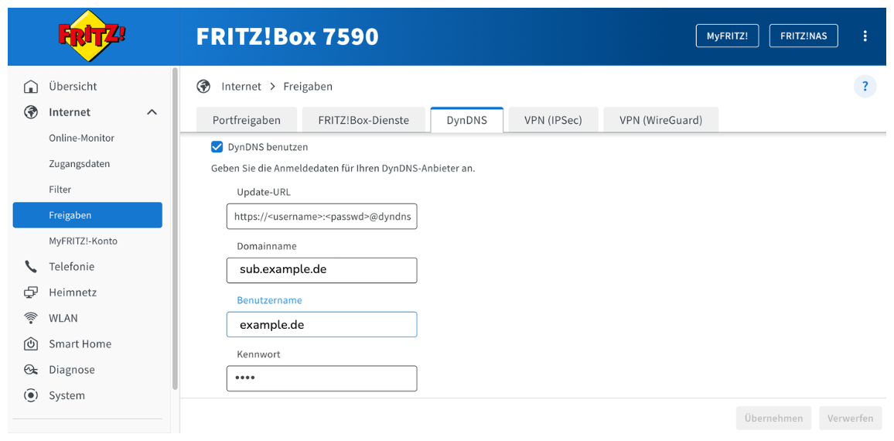
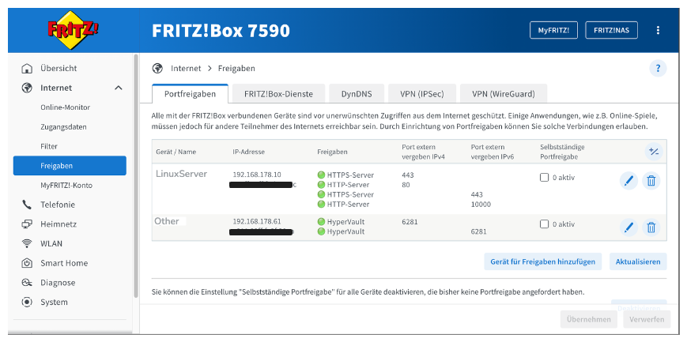
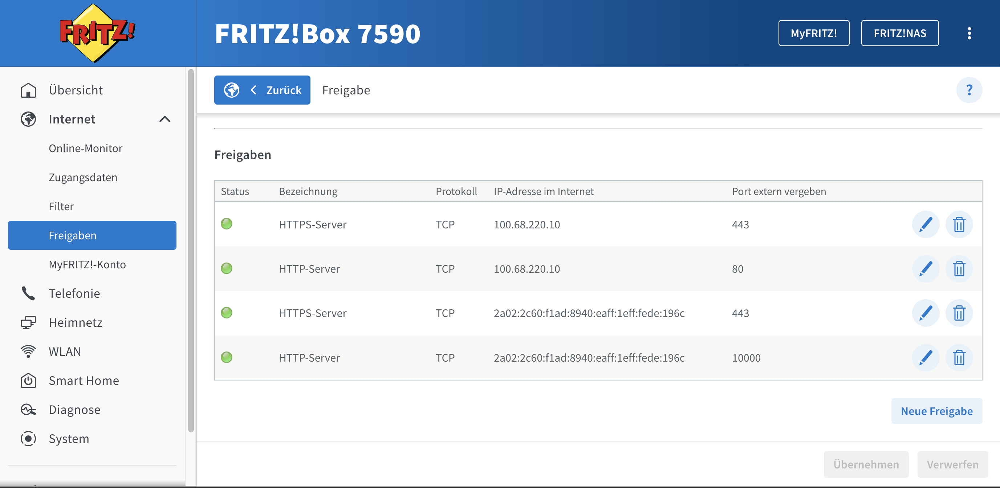
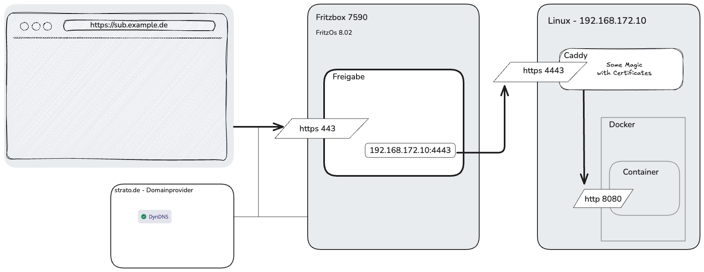

<link rel="stylesheet" href="setup.css">

# Verbindung Sub-Domain zu Server in meinem Netzwerk hinter einem Fritzbox-Router

## Was will ich erreichen

Ich habe eine Domain `sub.example.de` bei Strato. Diese soll auf einen Server in meinem heimischen Netzwerk zeigen, der hinter einem Fritzbox Router 7590 steht.

Eine öffentliche Internet Anfrage an `https://sub.example.de` soll auf den Server in meinem lokalen Netzwerk auf `192.168.178.10` unter Port `10001` weiterleiten und die Anfrage beantworten.

### Annahmen 

Da von aussen mit `https` angefragt wird, gehe ich davon aus, dass der Router `https` 1:1 weiterleitet.  
Nun muss also der Server unter `192.168.178.10` mit dem https-Handling umgehen bzw. das Zertifkat ausstellen bzw. validieren?   

Wie ich verstehe, gibt es kostenlos Zertifkate z.B. bei [Let's Encrypt](https://letsencrypt.org).  
Jetzt muss das noch mit meinem Server vereint werden, wozu die Software [Caddy](https://caddyserver.com) dienen wird.  
Diese wird die Anfragen auf dem Server `192.168.178.10:xyz` entgegen nehmen, es mit dem Zertifikat vereinen und intern auf einen beliebigen Port weiterleiten, wo die eigentliche Server-Applikation lauscht.
Praktischerweise möchte ich hier die jeweilig einzelne Server-Software auf einem Docker Container laufen lassen.


## Was funktioniert

Der Server im Backend steht und hat die IP `192.168.172.10`.

Bevor ich Caddy und Docker aufsetze, habe ich zwei einfache Python3 Test-Server laufen. Einen auf für `HTTP` auf Port `10000` und einen für `HTTPS` auf Port `10001`, der ein unsicheres Zertifikat hat; halt noch ohne `Let's Encrypt`.

Diese sind beide im lokalen Netzwerk funktionierend erreichbar.

### Was funktioniert nicht

Ich bekomme keinen Ping an meine Adresse `sub.example.de`.
Probiert z.B. auf [https://ipv64.net/ping_online]().

Folgende Aufrufe funktionieren wie folgt:

|Aufruf|aus Heimnetz|Internet|
|-|-|-|
|http://192.168.178.10:10000|OK|-|
|https://192.168.178.10:10001|OK|-|
|http://sub.example.de|_Routing auf https_|fail|
|https://sub.example.de|Login Fritzbox|fail|

*) funktionierte vor einem Löschen der DNS Caches auf MacOS mit
```
sudo dscacheutil -flushcache
sudo killall -HUP mDNSResponder
```

## Die Fritzbox 7590

Referenz zur Einrichtung:  
[https://www.strato.de/faq/hosting/so-einfach-richten-sie-dyndns-fuer-ihre-domains-ein/]()   
&gt; _Wie richte ich DynDNS in meiner AVM Fritz!Box ein?_

### DynDNS
Die Update URL lautet `https://<username>:<passwd>@dyndns.strato.com/nic/update?hostname=<domain>&myip=<ipaddr>,<ip6addr>`.



### Freigaben

Die Fritzbox hat jeweilige Freigaben eingerichtet:




## Gewünschtes End-Szenario

- Fritzbox
  Die Fritzbox soll keinen Admin-Zugang im öffentlichen Internet anbieten.


